# Engine 2 — Project Architecture: P23 Health-Workforce Redistribution

The prioritization engine ([E01](E01-prioritization-engine.md)) ranked **P23** first across
all four MCDA methods (P(top5)=1.00). This is its complete architecture.

## 1. Problem definition

> **In a fixed sanctioned-strength regime, the geographic distribution of health workers is
> driven by history, seniority, and political preference rather than population health need,
> producing a large, measurable, and reversible burden of avoidable mortality and morbidity
> from access gaps.**

Formally: find the redistribution of existing cadres across facilities that minimizes the
population-weighted, equity-adjusted access deficit, subject to feasibility (no facility
below safe-minimum staffing, bounded transfers, retention constraints).

$$
\min_{g}\;\sum_{i} w_i\, N_i\, \Phi\!\Big(\text{need}_i - \textstyle\sum_r \rho_r\, g_{ir}\Big)
\quad\text{s.t.}\quad \sum_i g_{ir}=G_r,\; g_{ir}\ge g^{\min}_{ir},\; \|g-g^0\|_1\le \tau
$$

where $\Phi$ is the burden-translating loss of unmet need, $\rho_r$ the productivity of cadre
$r$, $G_r$ the fixed pool, $g^0$ current posting, $\tau$ the political-feasibility transfer budget.

## 2. Conceptual framework

Instantiation of the Avoidable-Burden Decision Chain: **staffing → effective coverage →
realized care → avoided burden.** Workforce is the binding $\kappa$ (fidelity/availability)
term in the master objective $a_{ij}=e_j\kappa_{ij}$ — a clinic with no staff has $\kappa=0$
regardless of intervention efficacy.

## 3. Theory of change

```
Inputs            Activities             Outputs              Outcomes            Impact
─────────────────────────────────────────────────────────────────────────────────────────
HRMIS + burden  → need-based optimizer → redistribution plan → ↑ staffed-functional → ↓ avoidable
data + costs      + retention model      + transfer policy      facilities; ↓ travel   deaths,
                                          accepted by state      time to effective      DALYs;
                                                                 care                   ↑ equity
                  Assumption A1: transfers are politically executable within budget τ
                  Assumption A2: a posted worker is a functional worker (tested via audit)
                  Assumption A3: need is measurable from routine data + burden posterior
```

## 4. Causal model (narrative)

Maldistribution → unfilled effective demand at high-need facilities → delayed/forgone care →
excess case-fatality and untreated morbidity → avoidable deaths/DALYs, concentrated in
poor/remote strata (the equity channel). Confounders: facility infrastructure, demand
suppression, private-sector substitution, road access.

## 5. Directed acyclic graph (DAG)

```mermaid
graph LR
  REMOTE[Remoteness] --> STAFF[Staffing level]
  POL[Political/seniority] --> STAFF
  INFRA[Infrastructure] --> STAFF
  INFRA --> CARE[Effective care delivered]
  STAFF --> CARE
  DEMAND[Care-seeking] --> CARE
  REMOTE --> DEMAND
  WEALTH[Wealth/poverty] --> DEMAND
  WEALTH --> PRIV[Private substitution]
  PRIV --> CARE
  CARE --> BURDEN[Avoidable mortality/DALYs]
  REMOTE --> BURDEN
  WEALTH --> BURDEN
  classDef t fill:#cde,stroke:#369;
  class STAFF t;
```



**Identification:** staffing→burden effect is confounded by remoteness, infrastructure, wealth.
Adjustment set {Remoteness, Infrastructure, Wealth, Demand} blocks back-door paths. Reinforce
with a facility-fixed-effects panel (exploiting transfer-induced staffing changes over time)
and an instrument (sanctioned-post revisions) for robustness/triangulation.

## 6. Logic model

| Inputs | Activities | Outputs | Short outcomes | Long outcomes |
|---|---|---|---|---|
| HRMIS, HMIS, GIS, costs, burden posterior | WISN + Bayesian need estimation; assignment MIP; retention model; stakeholder co-design | Optimal posting plan; access-deficit atlas; retention-risk flags | ↑ staffed-functional facilities; ↓ effective travel time | ↓ avoidable deaths/DALYs; ↓ HEDI (equity deficit) |

## 7. Policy pathways

1. **Transfer/posting policy** — embed optimizer output into the annual transfer counselling.
2. **Differential incentives** — hardship allowances calibrated to retention-risk model.
3. **Cadre-mix reform** — task-shifting where optimal (mid-level providers).
4. **Sanctioned-strength rationalization** — re-base sanctioned posts on need, not legacy.

## 8. Intervention pathways

Redistribution · targeted recruitment to deficit clusters · retention incentives ·
task-shifting/skill-mix · tele-support to thin sites · contract/locum bridging.

## 9. Stakeholder mapping

| Stakeholder | Interest | Power | Engagement |
|---|---|---|---|
| State Health Dept / NHM | Coverage, equity, audit compliance | High | **Owner / co-design** |
| Finance Dept | Cost neutrality | High | Manage closely |
| Health-worker unions | Fairness, hardship, transparency | High | **Negotiate early** |
| District officers (CMHO) | Operational feasibility | Med | Collaborate |
| Communities (high-need) | Access | Low (latent) | Empower / voice |
| Professional councils | Standards | Med | Consult |

## 10. Governance structure

Programme Board (state HFW Secretary chair) → Technical Working Group (PHDA methods core +
state HR cell) → District implementation cells. Decision cadence: quarterly re-optimization;
annual transfer-cycle integration. Transparency: published need-atlas + open optimizer.

## 11. Leverage points, bottlenecks, failure modes, uncertainty

- **Leverage points (highest first):** (i) the transfer-budget constraint τ — relaxing it
  unlocks most avoidable burden; (ii) retention incentives at deficit clusters; (iii)
  task-shifting policy; (iv) data quality on "functional vs posted".
- **Bottlenecks:** union acceptance; HRMIS data accuracy; finance sign-off; absentee posts.
- **Failure modes:** posted-but-absent staff (κ collapse); gaming of need metrics; transfer
  reversal under political pressure; equity weights mis-set entrenching status quo.
- **Uncertainty sources:** burden posterior (need); productivity ρ by cadre; effective-coverage
  elasticity to staffing; retention probabilities. All carried as posteriors into the optimizer.

## 12. Systems map (causal-loop)

```mermaid
graph TD
  S[Staffing at high-need sites] -->|+| C[Effective coverage]
  C -->|+| O[Health outcomes/trust]
  O -->|+| D[Care-seeking demand]
  D -->|+| W[Workload]
  W -->|-| R[Retention/morale]   %% balancing loop B1
  R -->|+| S
  INC[Retention incentives] -->|+| R
  POL[Transparent need-based policy] -->|+| S
  AUD[Functionality audit] -->|+| C
  classDef pos fill:#dfd; class S,C,O pos;
```

Two loops: **R1 (reinforcing virtuous):** staffing→coverage→outcomes→trust→demand (and
political support for more staffing). **B1 (balancing trap):** staffing→demand→workload→
burnout→attrition→destaffing. Incentives (INC) and policy (POL) are the designed
interventions that keep R1 dominant over B1.

Publication-quality figures: the DAG (§5), the systems map (§12), the access-deficit atlas,
and the redistribution flow map are the four headline figures for the manuscript
(target *Human Resources for Health* / *BMJ Global Health* — see [E11](E11-manuscript-factory.md)).
