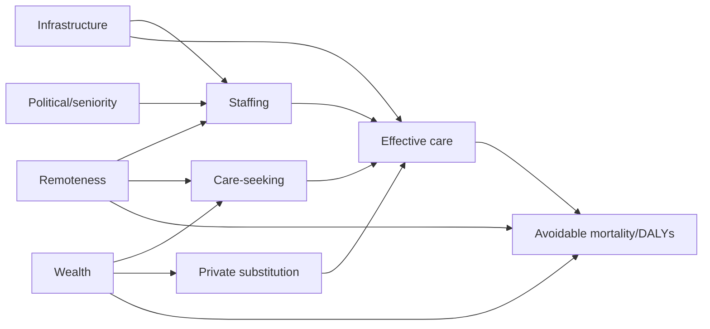
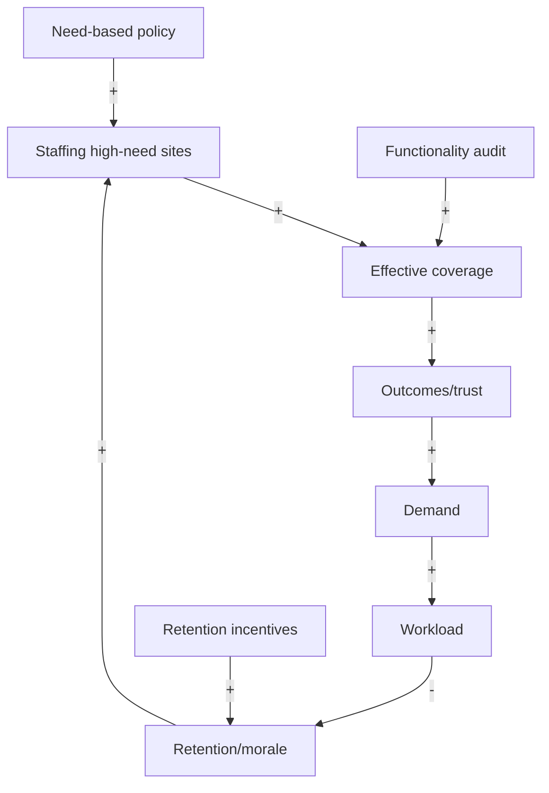
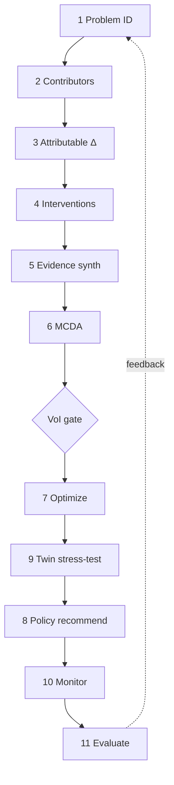
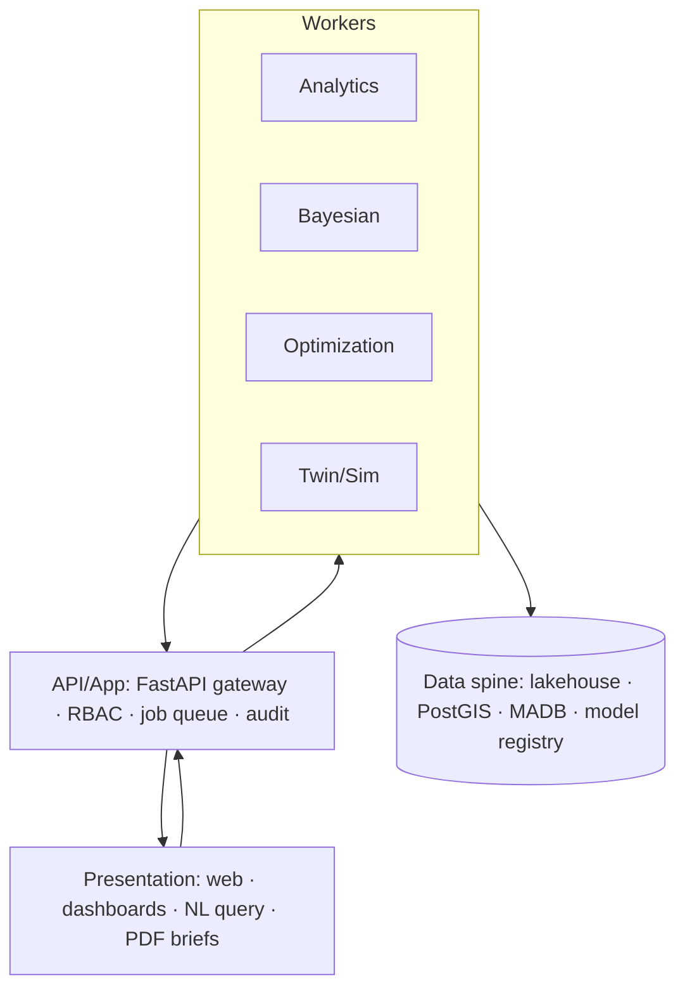
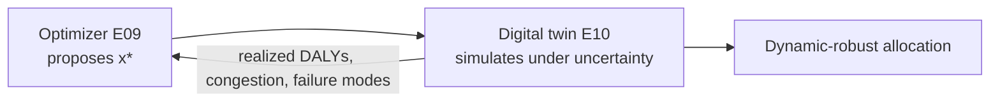
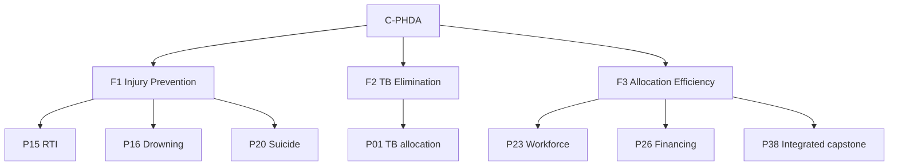

# PHDAROP — Framework, Causal, and Architecture Diagrams

All diagrams in one place (Mermaid + ASCII). Referenced throughout Parts 1–12 and engines E01–E14.

## 1. The Avoidable-Burden Decision Chain (ABDC) — master framework

```mermaid
flowchart LR
  D[(Data / MADB)] --> B[1. Burden<br/>B_idt]
  B --> A[2. Attribute<br/>PAF, CFA, η]
  A --> AV[3. Avoidable<br/>Δ = B − B*]
  AV --> O[4. Optimize<br/>max A&#40;x&#41;]
  O --> V[5. Value of Info<br/>EVPI gate]
  V --> DEC[6. Decide<br/>MCDA → d*]
  DEC --> IMP[7. Implement<br/>fidelity κ]
  IMP --> RE[8. Re-measure<br/>B']
  RE -.feedback.-> B
```



## 2. Conceptual model — the master objective (annotated)

```
            equity weight   avoidable burden   realized effectiveness   decision
                  │                │                    │                  │
   A(x) =  Σ Σ   w_i      ·      Δ_ij        ·        a_ij        ·      x_ij
          i j
   s.t.   Σ cost·x ≤ Budget ,  Σ wf·x ≤ Workforce ,  equity floor ,  x ∈ F
   ───────────────────────────────────────────────────────────────────────────
   Part 4 gives Δ · Part 5 gives a · Part 3 measures the gap · Part 6/E09 solves for x*
```

## 3. Causal pathway (workforce → avoidable burden) — DAG



## 4. Systems map — causal-loop (workforce dynamics)



## 5. Decision pipeline (11 stages) — see Part 7 for the full annotated version



## 6. Software architecture — see E12/Part 8



## 7. Optimizer ⇄ Digital-twin loop (signature method)



## 8. Three flagship programmes (org → projects)



## 9. Efficiency–equity frontier (schematic; computed values in E09)

```
 raw DALYs
 averted │ ●───●───●───●───●───●───●───●───●
   (k)   │                                  ●╮  equity protection
         │                                    ╰●  costs ~3% efficiency
         └────────────────────────────────────────► equity floor (0 → 1)
         the policymaker chooses the operating point on this curve
```

All Mermaid blocks render in GitHub/most markdown viewers; ASCII fallbacks are provided where
layout matters.
